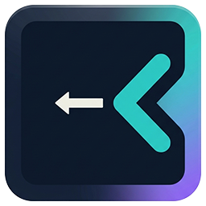

<div align="center">
  

  # Rtl Terminal

  **A Windows terminal emulator with Persian, Arabic and right-to-left text support**

  **ترمینال ویندوز با پشتیبانی از فارسی، عربی و نمایش راست‌به‌چپ**

  **محاكي طرفية لويندوز يدعم العربية والفارسية واتجاه الكتابة من اليمين إلى اليسار**

  [English](#english) · [فارسی](#فارسی) · [العربية](#العربية)
</div>

---

## English

### Rtl Terminal for Windows

**Rtl Terminal** is an open-source Windows terminal emulator created by **behnamapps** for Persian, Arabic and other right-to-left language users. It provides a switchable RTL terminal view while preserving ANSI colors, interactive command-line applications, progress bars, links, Unicode text and standard terminal keyboard input.

Rtl Terminal uses the Windows ConPTY API and works with command-line environments such as Command Prompt, PowerShell, WSL, Bash, developer tools, package managers and interactive terminal applications.

### Features

- Switch the complete terminal between left-to-right and right-to-left display.
- Display Persian, Arabic, English and mixed Unicode terminal output.
- Support ANSI standard colors, bright colors, dim text, 256 colors and RGB colors.
- Run interactive CLI and TUI applications through Windows ConPTY.
- Render animated progress bars and in-place terminal line updates.
- Keep up to 5,000 lines of scrollback history.
- Detect `http://`, `https://` and `www.` links and open them with `Ctrl + Click`.
- Copy selected text with `Ctrl+C` or `Ctrl+Shift+C`.
- Paste with `Ctrl+V`, `Ctrl+Shift+V` or right-click when no text is selected.
- Send `Ctrl+C` as an interrupt when no text is selected.
- Select any installed Windows font, font size, weight and italic style.
- Show recommended terminal and programming fonts when installed.
- Optionally add **Open in RtlTerminal** to the Windows folder context menu.
- Open a terminal directly in the selected folder.
- Provide a built-in RTL help window.
- Support self-contained, single-file Windows releases.

### Screenshots

Screenshots can be added to a `docs/screenshots` directory and referenced here:

```markdown

```

Using descriptive screenshot filenames and alternative text helps users and search engines understand the project.

### System Requirements

- Windows 10 version 1809 or newer
- Windows 11
- x64 processor for the provided release configuration

Windows 10 version 1809 is the minimum supported version because Rtl Terminal uses the Windows ConPTY API. Windows 7 and Windows 10 versions older than 1809 are not supported by the current backend.

### Installation

#### Installer

Download the latest `RtlTerminal-Setup-*-x64.exe` file from the GitHub Releases page and run it. The installer provides:

- Start Menu shortcut
- Optional desktop shortcut
- Standard Windows uninstaller
- Application icon and product metadata

#### Portable Version

Download `RtlTerminal.exe` from the release assets and run it directly. The self-contained build does not require a separate .NET installation.

### Build from Source

Requirements:

- Windows 10 version 1809 or newer
- .NET 8 SDK
- Visual Studio 2022 with WPF support, or the .NET CLI
- Inno Setup 6 when building the installer

Clone your published repository, then build it:

```powershell
git clone https://github.com/mirbehnam/RtlTerminal.git
cd RtlTerminal
dotnet build RtlTerminal.csproj
```

Create a self-contained x64 release:

```powershell
dotnet publish RtlTerminal.csproj `
  -c Release `
  -r win-x64 `
  --self-contained true `
  -p:PublishSingleFile=true `
  -p:IncludeNativeLibrariesForSelfExtract=true `
  -p:PublishTrimmed=false `
  -o publish\win-x64
```

The portable executable is created at:

```text
publish\win-x64\RtlTerminal.exe
```

To publish the application and build the installer with Inno Setup:

```powershell
.\build-release.ps1
```

The installer is created in:

```text
release\RtlTerminal-Setup-1.0.0-x64.exe
```

### Automatic GitHub Releases

The repository includes a GitHub Actions workflow that creates a self-contained, single-file Windows x64 build. Push a version tag to create a GitHub Release automatically:

```powershell
git tag v1.0.0
git push origin v1.0.0
```

The workflow publishes these downloadable release assets:

```text
RtlTerminal-1.0.0-win-x64.exe
RtlTerminal-1.0.0-win-x64.zip
```

The executable is standalone and does not require a separate .NET installation. The workflow can also be started manually from the GitHub **Actions** page; manual runs create downloadable workflow artifacts without creating a GitHub Release.

### Keyboard and Mouse Shortcuts

| Action | Shortcut |
|---|---|
| Copy selected text | `Ctrl+C` or `Ctrl+Shift+C` |
| Paste clipboard text | `Ctrl+V` or `Ctrl+Shift+V` |
| Paste with mouse | Right-click when no text is selected |
| Interrupt the active command | `Ctrl+C` when no text is selected |
| Open a detected link | Hold `Ctrl` and click the blue link |
| Toggle RTL display | `View` → `Right-to-left` |
| Change terminal font | `Edit` → `Font settings` |
| Install or remove folder context menu | `Tools` → `Open in RtlTerminal` |

### Font Support

The font settings window lists every font installed on Windows. It also includes a **Standard fonts** section for installed terminal and programming fonts such as:

- Cascadia Mono
- Cascadia Code
- Consolas
- Lucida Console
- JetBrains Mono
- Fira Code
- Source Code Pro
- IBM Plex Mono
- DejaVu Sans Mono
- Ubuntu Mono
- Hack
- Iosevka
- Nerd Fonts

Monospaced fonts are recommended for correct terminal alignment.

### Windows Context Menu

On first launch, Rtl Terminal can optionally add **Open in RtlTerminal** for folders and folder backgrounds. The integration is registered for the current Windows user and can later be enabled or removed from the `Tools` menu.

On Windows 11, the current registry integration may appear under **Show more options**. Native placement in the modern Windows 11 context menu requires a packaged shell extension.

### Known Limitations

- The current terminal backend requires Windows ConPTY.
- Windows 7 is not supported.
- The Windows 11 modern context menu is not directly extended by the current registry integration.
- Terminal rendering is implemented with WPF rather than the GPU renderer used by Windows Terminal.

### Project Information

- Product: **Rtl Terminal**
- Brand: **behnamapps**
- Developer: **behnam tajadini**
- YouTube: **akatechno**
- Technology: **C# · .NET 8 · WPF · Windows ConPTY**

### Contributing

Bug reports, compatibility reports, pull requests and translations are welcome. When reporting a terminal rendering issue, include:

- Windows version
- Command or application being executed
- Expected output
- Actual output
- Screenshot or a short screen recording
- Reproduction steps

### License

No license file is currently included. Add a `LICENSE` file before accepting external contributions or distributing the source under an open-source license.

---

## فارسی

### ترمینال راست‌به‌چپ برای ویندوز

**Rtl Terminal** یک شبیه‌ساز ترمینال متن‌باز برای ویندوز است که توسط برند **behnamapps** برای کاربران فارسی‌زبان، عربی‌زبان و زبان‌های راست‌به‌چپ ساخته شده است. این برنامه امکان تغییر کل محیط ترمینال بین حالت چپ‌به‌راست و راست‌به‌چپ را فراهم می‌کند و در کنار آن از رنگ‌های ANSI، برنامه‌های تعاملی خط فرمان، نوارهای پیشرفت، لینک‌ها و متن Unicode پشتیبانی می‌کند.

این برنامه با استفاده از Windows ConPTY می‌تواند محیط‌هایی مانند Command Prompt، PowerShell، WSL، Bash، ابزارهای توسعه، package managerها و برنامه‌های تعاملی ترمینال را اجرا کند.

### امکانات

- تغییر کل صفحه ترمینال بین حالت LTR و RTL
- نمایش متن فارسی، عربی، انگلیسی و متن‌های ترکیبی
- پشتیبانی از رنگ‌های ANSI، رنگ‌های روشن، متن کم‌رنگ، ۲۵۶ رنگ و RGB
- اجرای برنامه‌های CLI و TUI تعاملی
- پشتیبانی از progress bar و بازنویسی خروجی روی همان خط
- نگهداری تا ۵۰۰۰ خط سابقه برای اسکرول عمودی
- تشخیص لینک و بازکردن آن با `Ctrl + Click`
- کپی متن با `Ctrl+C` یا `Ctrl+Shift+C`
- Paste با `Ctrl+V`، `Ctrl+Shift+V` یا راست‌کلیک
- ارسال Interrupt با `Ctrl+C` در صورتی که متنی انتخاب نشده باشد
- انتخاب همه فونت‌های نصب‌شده ویندوز
- تنظیم اندازه، ضخامت و حالت ایتالیک فونت
- نمایش فونت‌های استاندارد ترمینال و برنامه‌نویسی در صورت نصب‌بودن
- افزودن اختیاری گزینه **Open in RtlTerminal** به منوی راست‌کلیک پوشه‌ها
- بازکردن ترمینال مستقیماً در مسیر پوشه انتخاب‌شده
- راهنمای داخلی با پشتیبانی کامل از RTL

### نیازمندی‌های سیستم

- ویندوز ۱۰ نسخه 1809 یا جدیدتر
- ویندوز ۱۱
- پردازنده ۶۴ بیتی برای خروجی فعلی

نسخه 1809 ویندوز ۱۰ حداقل نسخه پشتیبانی‌شده است، زیرا برنامه از API مربوط به Windows ConPTY استفاده می‌کند. ویندوز ۷ و نسخه‌های قدیمی‌تر ویندوز ۱۰ در backend فعلی پشتیبانی نمی‌شوند.

### نصب

برای نصب معمولی، آخرین فایل `RtlTerminal-Setup-*-x64.exe` را از بخش Releases گیت‌هاب دانلود و اجرا کنید. فایل نصب دارای میان‌بر Start Menu، میان‌بر اختیاری Desktop و Uninstall استاندارد ویندوز است.

برای استفاده به‌صورت Portable، فایل `RtlTerminal.exe` را دانلود و مستقیماً اجرا کنید. نسخه self-contained به نصب جداگانه .NET نیاز ندارد.

### ساخت از سورس

ابتدا .NET 8 SDK را نصب کنید، سپس:

```powershell
git clone https://github.com/mirbehnam/RtlTerminal.git
cd RtlTerminal
dotnet build RtlTerminal.csproj
```

برای ساخت نسخه مستقل:

```powershell
dotnet publish RtlTerminal.csproj `
  -c Release `
  -r win-x64 `
  --self-contained true `
  -p:PublishSingleFile=true `
  -p:IncludeNativeLibrariesForSelfExtract=true `
  -p:PublishTrimmed=false `
  -o publish\win-x64
```

برای ساخت فایل نصب، Inno Setup 6 را نصب کرده و فرمان زیر را اجرا کنید:

```powershell
.\build-release.ps1
```

### ساخت خودکار Release در گیت‌هاب

این مخزن دارای GitHub Actions است که نسخه مستقل و تک‌فایلی ویندوز ۶۴ بیتی را می‌سازد. برای ایجاد Release خودکار، یک تگ نسخه ایجاد و Push کنید:

```powershell
git tag v1.0.0
git push origin v1.0.0
```

پس از پایان Workflow، فایل‌های مستقل `EXE` و `ZIP` در بخش Releases قرار می‌گیرند و برای اجرا به نصب جداگانه .NET نیاز ندارند. اجرای دستی Workflow از بخش Actions فقط Artifact قابل دانلود می‌سازد.

### میان‌برها

| عملیات | میان‌بر |
|---|---|
| کپی متن انتخاب‌شده | `Ctrl+C` یا `Ctrl+Shift+C` |
| چسباندن متن | `Ctrl+V` یا `Ctrl+Shift+V` |
| چسباندن با ماوس | راست‌کلیک در صورتی که متنی انتخاب نشده باشد |
| متوقف‌کردن فرمان جاری | `Ctrl+C` در صورتی که متنی انتخاب نشده باشد |
| بازکردن لینک | نگه‌داشتن `Ctrl` و کلیک روی لینک آبی |
| فعال‌کردن RTL | منوی `View` و گزینه `Right-to-left` |
| تغییر فونت | منوی `Edit` و گزینه `Font settings` |
| مدیریت منوی راست‌کلیک | منوی `Tools` و گزینه `Open in RtlTerminal` |

### مشارکت

گزارش باگ، پیشنهاد، ترجمه و Pull Request پذیرفته می‌شود. برای گزارش مشکلات رندر ترمینال، نسخه ویندوز، فرمان اجراشده، خروجی مورد انتظار، خروجی واقعی و مراحل بازتولید را ارسال کنید.

### مجوز

در حال حاضر فایل مجوز در پروژه وجود ندارد. قبل از انتشار پروژه به‌عنوان نرم‌افزار متن‌باز، یک فایل `LICENSE` مناسب اضافه کنید.

---

## العربية

### طرفية تدعم العربية واتجاه RTL لنظام Windows

**Rtl Terminal** هو محاكي طرفية مفتوح المصدر لنظام Windows، طوّرته علامة **behnamapps** لمستخدمي اللغة العربية والفارسية واللغات التي تُكتب من اليمين إلى اليسار. يتيح البرنامج تحويل واجهة الطرفية بالكامل بين اتجاهي LTR وRTL مع دعم ألوان ANSI والنصوص Unicode والروابط وأشرطة التقدم وتطبيقات سطر الأوامر التفاعلية.

يعتمد البرنامج على Windows ConPTY، ويمكنه تشغيل Command Prompt وPowerShell وWSL وBash وأدوات المطورين ومديري الحزم وتطبيقات CLI وTUI.

### المميزات

- تحويل عرض الطرفية بالكامل بين اليسار إلى اليمين واليمين إلى اليسار
- عرض النصوص العربية والفارسية والإنجليزية والنصوص المختلطة
- دعم ألوان ANSI والألوان الساطعة والنص الخافت و256 لوناً وألوان RGB
- تشغيل تطبيقات CLI وTUI التفاعلية
- دعم أشرطة التقدم وتحديث السطر نفسه
- الاحتفاظ بما يصل إلى 5000 سطر من سجل الطرفية
- اكتشاف الروابط وفتحها باستخدام `Ctrl + Click`
- نسخ النص باستخدام `Ctrl+C` أو `Ctrl+Shift+C`
- لصق النص باستخدام `Ctrl+V` أو `Ctrl+Shift+V` أو زر الفأرة الأيمن
- إرسال أمر المقاطعة عند الضغط على `Ctrl+C` دون تحديد نص
- اختيار جميع الخطوط المثبتة في Windows
- تخصيص حجم الخط ووزنه ونمطه المائل
- عرض خطوط الطرفية والبرمجة المقترحة عند توفرها
- إضافة خيار **Open in RtlTerminal** إلى قائمة المجلدات
- فتح الطرفية مباشرة داخل المجلد المحدد
- نافذة مساعدة داخلية تدعم RTL

### متطلبات النظام

- Windows 10 الإصدار 1809 أو أحدث
- Windows 11
- معالج x64 لإصدار التوزيع الحالي

الإصدار 1809 من Windows 10 هو الحد الأدنى لأن البرنامج يستخدم Windows ConPTY. لا يدعم backend الحالي نظام Windows 7 أو إصدارات Windows 10 الأقدم.

### التثبيت

حمّل أحدث ملف باسم `RtlTerminal-Setup-*-x64.exe` من صفحة GitHub Releases ثم شغّله. يضيف المثبّت اختصاراً في قائمة Start واختصاراً اختيارياً على سطح المكتب ويوفر أداة إزالة قياسية.

يمكن أيضاً تنزيل النسخة المحمولة `RtlTerminal.exe` وتشغيلها مباشرة. النسخة المستقلة لا تحتاج إلى تثبيت .NET بشكل منفصل.

### البناء من المصدر

ثبّت .NET 8 SDK ثم نفّذ:

```powershell
git clone https://github.com/mirbehnam/RtlTerminal.git
cd RtlTerminal
dotnet build RtlTerminal.csproj
```

لإنشاء إصدار مستقل:

```powershell
dotnet publish RtlTerminal.csproj `
  -c Release `
  -r win-x64 `
  --self-contained true `
  -p:PublishSingleFile=true `
  -p:IncludeNativeLibrariesForSelfExtract=true `
  -p:PublishTrimmed=false `
  -o publish\win-x64
```

لإنشاء ملف التثبيت، ثبّت Inno Setup 6 ثم شغّل:

```powershell
.\build-release.ps1
```

### إنشاء Release تلقائياً على GitHub

يتضمن المستودع GitHub Actions لبناء إصدار Windows x64 مستقل وذي ملف واحد. أنشئ وادفع وسم إصدار لإنشاء GitHub Release تلقائياً:

```powershell
git tag v1.0.0
git push origin v1.0.0
```

بعد اكتمال Workflow ستظهر ملفات `EXE` و`ZIP` المستقلة في صفحة Releases، ولا تحتاج النسخة التنفيذية إلى تثبيت .NET بشكل منفصل. التشغيل اليدوي من صفحة Actions ينشئ Artifact قابلاً للتنزيل فقط.

### الاختصارات

| العملية | الاختصار |
|---|---|
| نسخ النص المحدد | `Ctrl+C` أو `Ctrl+Shift+C` |
| لصق النص | `Ctrl+V` أو `Ctrl+Shift+V` |
| اللصق بالفأرة | زر الفأرة الأيمن عند عدم تحديد نص |
| مقاطعة الأمر الحالي | `Ctrl+C` عند عدم تحديد نص |
| فتح رابط | اضغط باستمرار على `Ctrl` ثم انقر على الرابط الأزرق |
| تفعيل اتجاه RTL | قائمة `View` ثم `Right-to-left` |
| تغيير الخط | قائمة `Edit` ثم `Font settings` |
| إدارة قائمة المجلدات | قائمة `Tools` ثم `Open in RtlTerminal` |

### المساهمة

نرحب بتقارير الأخطاء والاقتراحات والترجمات وطلبات Pull Request. عند الإبلاغ عن مشكلة في عرض الطرفية، أرفق إصدار Windows والأمر المستخدم والنتيجة المتوقعة والنتيجة الفعلية وخطوات إعادة المشكلة.

### الترخيص

لا يتضمن المشروع حالياً ملف ترخيص. أضف ملف `LICENSE` مناسباً قبل نشر المشروع كمشروع مفتوح المصدر أو قبول مساهمات خارجية.

---

## Search Keywords

Rtl Terminal, RTL terminal Windows, Persian terminal emulator, Arabic terminal emulator, Farsi terminal, Windows terminal with RTL support, Persian PowerShell terminal, Arabic PowerShell terminal, RTL command prompt, WSL Persian terminal, WSL Arabic terminal, Unicode terminal Windows, ConPTY terminal emulator, C# WPF terminal, ترمینال فارسی ویندوز, ترمینال راست به چپ, ترمینال عربی, محیط خط فرمان فارسی, طرفية عربية ويندوز, محاكي طرفية RTL, دعم العربية في الطرفية
