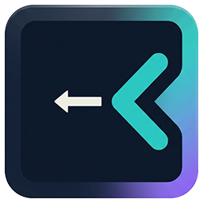
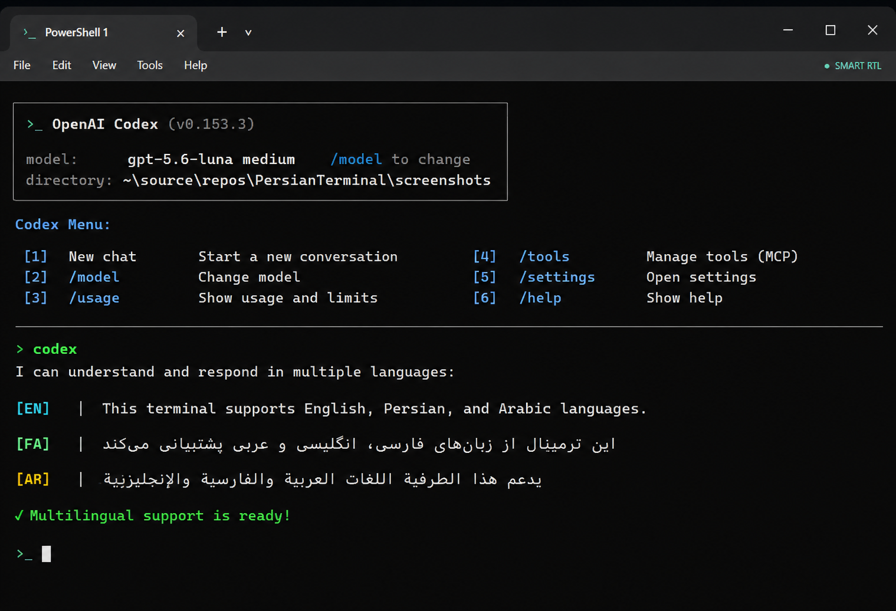
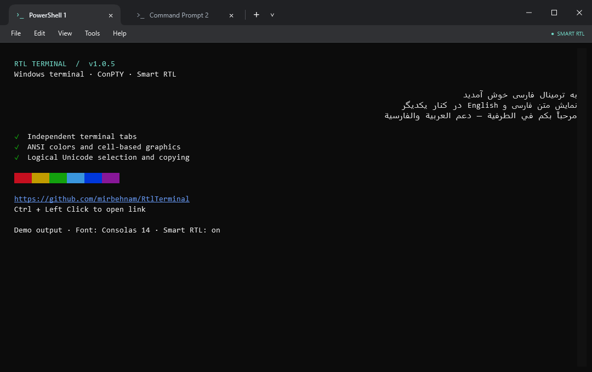
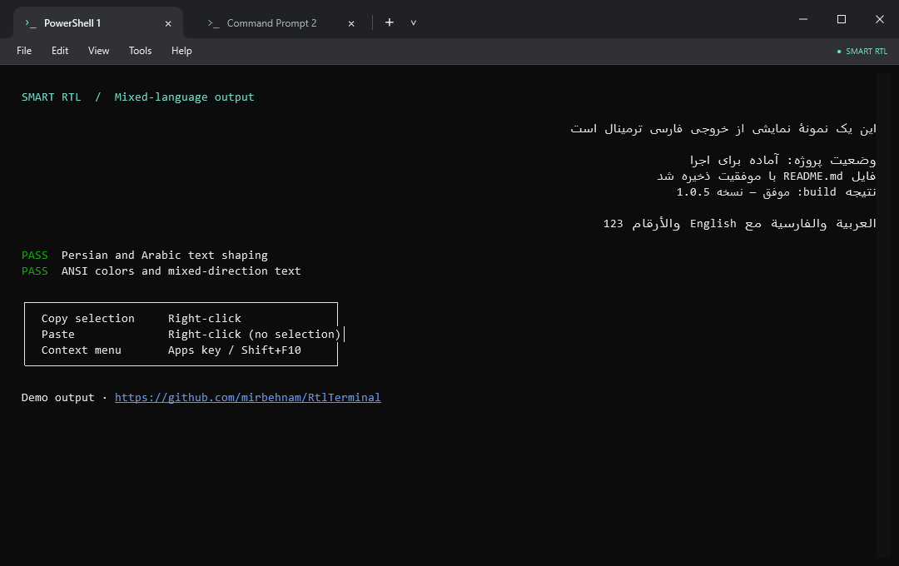

<div align="center">
  

  # Rtl Terminal

  **A Windows terminal emulator with Persian, Arabic and right-to-left text support**

  **ترمینال ویندوز با پشتیبانی از فارسی، عربی و نمایش راست‌به‌چپ**

  **محاكي طرفية لويندوز يدعم العربية والفارسية واتجاه الكتابة من اليمين إلى اليسار**

  [English](#english) · [فارسی](#فارسی) · [العربية](#العربية)

  <br>

  ## دانلود مستقیم فایل نصب · Direct Setup Download

  **آخرین نسخه مخصوص ویندوز ۱۰ و ۱۱ — بدون نیاز به نصب جداگانه .NET**

  **Latest Windows 10/11 installer — no separate .NET installation required**

  ### [⬇️ دریافت آخرین نسخهٔ منتشرشده](https://github.com/mirbehnam/RtlTerminal/releases/latest)

  ### [⬇️ Get the latest published release](https://github.com/mirbehnam/RtlTerminal/releases/latest)

  [وب‌سایت رسمی · Official website](https://mirbehnam.github.io/RtlTerminal/) · [مشاهده همه نسخه‌ها · View all releases](https://github.com/mirbehnam/RtlTerminal/releases)

  <br>

  

  **نمای اصلی Rtl Terminal در ویندوز · Rtl Terminal main window on Windows**
</div>

---

## English

### Rtl Terminal for Windows

**Rtl Terminal** is an open-source Windows terminal emulator created by **behnamapps** for Persian, Arabic and other right-to-left language users. It provides a switchable RTL terminal view while preserving ANSI colors, interactive command-line applications, progress bars, links, Unicode text and standard terminal keyboard input.

Rtl Terminal uses the Windows ConPTY API and works with command-line environments such as Command Prompt, PowerShell, WSL, Bash, developer tools, package managers and interactive terminal applications.

### Features

- Custom WPF cell renderer with cached visible rows and seamless block/box graphics.
- Chrome-style tabs, adjacent new-tab button, dark menus and vector window controls.
- Default terminal font size of 14; existing saved font preferences are retained.
- Apply Smart RTL per line while keeping English fragments, numbers and punctuation in their correct direction.
- Display Persian, Arabic, English and mixed Unicode terminal output.
- Support ANSI standard colors, bright colors, dim text, 256 colors and RGB colors.
- Run interactive CLI and TUI applications through Windows ConPTY.
- Open multiple Command Prompt, PowerShell and WSL sessions in independent tabs.
- Switch tabs with `Ctrl+Tab`, create a tab with `Ctrl+Shift+T` and close it with `Ctrl+W`.
- Render animated progress bars and in-place terminal line updates.
- Keep long-running AI agent output responsive with incremental scrollback rendering.
- Choose a 2,000, 5,000 or 10,000-line scrollback history limit in Font settings.
- Detect `http://`, `https://` and `www.` links and open them with `Ctrl + Click`.
- Copy selected text with `Ctrl+C` or `Ctrl+Shift+C`.
- Paste text, copied file paths and clipboard images with `Ctrl+V`, `Ctrl+Shift+V` or right-click.
- Clipboard paths retain their Windows form; convert paths manually when needed in WSL.
- Send `Ctrl+C` as an interrupt when no text is selected.
- Select any installed Windows font, font size, weight and italic style.
- Render ANSI bold and italic styles produced by terminal applications.
- Show recommended terminal and programming fonts when installed.
- Optionally add **Open in RtlTerminal** to the Windows folder context menu.
- Open a terminal directly in the selected folder.
- Remember whether new tabs should use Command Prompt, PowerShell or WSL.
- Reopen one of the ten most recent Command Prompt directories from the File menu.
- Export the retained content of the current terminal session to a UTF-8 text file.
- Provide a built-in guide in English, Persian and Arabic.
- Check GitHub Releases for updates manually or at startup, with a per-version dismissal option.
- Use a consistent dark interface for menus, tabs and window controls.
- Support self-contained, single-file Windows releases.

### Screenshots

#### Main application — OpenAI Codex

The main screenshot shows a real Codex session rendering English, Persian and Arabic
inside Rtl Terminal with Smart RTL enabled.


#### Renderer test scenarios





### System Requirements

- Windows 10 version 1809 or newer
- Windows 11
- x64 processor for the provided release configuration

Windows 10 version 1809 is the minimum supported version because Rtl Terminal uses the Windows ConPTY API. Windows 7 and Windows 10 versions older than 1809 are not supported by the current backend.

### Installation

#### Installer

Download the latest `RtlTerminal-Setup-*-x64.exe` file from the GitHub Releases page and run it. The installer provides:

- Start Menu shortcut
- Optional desktop shortcut
- Standard Windows uninstaller
- Application icon and product metadata

#### Portable Version

Download `RtlTerminal.exe` from the release assets and run it directly. The self-contained build does not require a separate .NET installation.

### Build from Source

Requirements:

- Windows 10 version 1809 or newer
- .NET 8 SDK
- Visual Studio 2022 with WPF support, or the .NET CLI
- Inno Setup 6 when building the installer

Clone your published repository, then build it:

```powershell
git clone https://github.com/mirbehnam/RtlTerminal.git
cd RtlTerminal
dotnet build RtlTerminal.csproj
```

Create a self-contained x64 release:

```powershell
dotnet publish RtlTerminal.csproj `
  -c Release `
  -r win-x64 `
  --self-contained true `
  -p:PublishSingleFile=true `
  -p:IncludeNativeLibrariesForSelfExtract=true `
  -p:PublishTrimmed=false `
  -o publish\win-x64
```

The portable executable is created at:

```text
publish\win-x64\RtlTerminal.exe
```

To publish the application and build the installer with Inno Setup:

```powershell
.\build-release.ps1
```

The installer is created in:

```text
release\RtlTerminal-Setup-1.0.5-x64.exe
```

### Automatic GitHub Releases

The repository includes a GitHub Actions workflow that creates a self-contained, single-file Windows x64 build. Push a version tag to create a GitHub Release automatically:

```powershell
git tag v1.0.5
git push origin v1.0.5
```

The workflow publishes these downloadable release assets:

```text
RtlTerminal-1.0.5-win-x64.exe
RtlTerminal-1.0.5-win-x64.zip
RtlTerminal-Setup-1.0.5-x64.exe
```

The portable executable and installer include the self-contained .NET runtime and do not require a separate .NET installation. The Setup file provides installation shortcuts and standard Windows uninstall support. The workflow can also be started manually from the GitHub **Actions** page; manual runs create downloadable workflow artifacts without creating a GitHub Release.

### Keyboard and Mouse Shortcuts

| Action | Shortcut |
|---|---|
| Copy selected text | `Ctrl+C` or `Ctrl+Shift+C` |
| Paste clipboard text | `Ctrl+V` or `Ctrl+Shift+V` |
| Paste copied files or images as paths | `Ctrl+V` or `Ctrl+Shift+V` |
| Paste with mouse | Right-click when no text is selected |
| Copy with mouse | Right-click selected text; the selection clears after copying |
| Open Copy/Paste menu | Context Menu (Apps) key or `Shift+F10`; opens after key release |
| Select all retained text | `Ctrl+Shift+A` |
| Bypass application mouse capture | Hold `Shift` while selecting or right-clicking |
| Create a tab using the default profile | `Ctrl+Shift+T` |
| Switch to the next or previous tab | `Ctrl+Tab` or `Ctrl+Shift+Tab` |
| Close the active tab | `Ctrl+W` |
| Interrupt the active command | `Ctrl+C` when no text is selected |
| Open a detected link | Hold `Ctrl` and click the blue link |
| Toggle automatic RTL detection | `View` → `Smart RTL` |
| Change terminal font or history size | `Edit` → `Font settings` |
| Export the current session | `File` → `Export session` |
| Check for updates | `Help` → `Check for updates` |
| Install or remove folder context menu | `Tools` → `Open in RtlTerminal` |

### Font Support

The font settings window lists every font installed on Windows. It also includes a **Standard fonts** section for installed terminal and programming fonts such as:

- Cascadia Mono
- Cascadia Code
- Consolas
- Lucida Console
- JetBrains Mono
- Fira Code
- Source Code Pro
- IBM Plex Mono
- DejaVu Sans Mono
- Ubuntu Mono
- Hack
- Iosevka
- Nerd Fonts

Monospaced fonts are recommended for correct terminal alignment.

### Windows Context Menu

On first launch, Rtl Terminal can optionally add **Open in RtlTerminal** for folders and folder backgrounds. The integration is registered for the current Windows user and can later be enabled or removed from the `Tools` menu.

On Windows 11, the current registry integration may appear under **Show more options**. Native placement in the modern Windows 11 context menu requires a packaged shell extension.

### Known Limitations

- The current terminal backend requires Windows ConPTY.
- Windows 7 is not supported.
- The Windows 11 modern context menu is not directly extended by the current registry integration.
- The custom WPF renderer is not the Windows Terminal rendering engine; CLI/TUI compatibility still needs application-specific testing.
- Color emoji, flags and font fallback depend on the Windows text renderer and installed fonts.
- Smart RTL uses directional spans, not a complete new Unicode bidi implementation; full-screen layouts preserve the terminal grid.

### Validation and screenshot capture

```powershell
dotnet build RtlTerminal.sln -c Release
dotnet run --project tests/RtlTerminal.BufferTests -c Release
dotnet run --project tests/RtlTerminal.RenderTests -c Release
dotnet run --project tests/RtlTerminal.RenderTests -c Release -- --window-smoke
```

The optional `--window-smoke` check briefly opens a shell-free test window and
checks context-menu key down/up, maximized work-area bounds and minimize/restore.
To regenerate the two renderer-test screenshots with deterministic demo content:

```powershell
dotnet run --project tests/RtlTerminal.RenderTests -c Release -- --screenshots
```

See [renderer architecture and verification notes](docs/renderer.md).

### Project Information

- Product: **Rtl Terminal**
- Brand: **behnamapps**
- Developer: **behnam tajadini**
- YouTube: **aka_techno**
- Technology: **C# · .NET 8 · WPF · Windows ConPTY**

### Contributing

Bug reports, compatibility reports, pull requests and translations are welcome. When reporting a terminal rendering issue, include:

- Windows version
- Command or application being executed
- Expected output
- Actual output
- Screenshot or a short screen recording
- Reproduction steps

### License

No license file is currently included. Add a `LICENSE` file before accepting external contributions or distributing the source under an open-source license.

---

## فارسی

### ترمینال راست‌به‌چپ برای ویندوز

**Rtl Terminal** یک شبیه‌ساز ترمینال متن‌باز برای ویندوز است که توسط برند **behnamapps** برای کاربران فارسی‌زبان، عربی‌زبان و زبان‌های راست‌به‌چپ ساخته شده است. این برنامه با Smart RTL جهت متن فارسی و ترکیبی را خودکار مدیریت می‌کند و شبکهٔ برنامه‌های تمام‌صفحه را حفظ می‌کند و در کنار آن از رنگ‌های ANSI، برنامه‌های تعاملی خط فرمان، نوارهای پیشرفت، لینک‌ها و متن Unicode پشتیبانی می‌کند.

این برنامه با استفاده از Windows ConPTY می‌تواند محیط‌هایی مانند Command Prompt، PowerShell، WSL، Bash، ابزارهای توسعه، package managerها و برنامه‌های تعاملی ترمینال را اجرا کند.

### امکانات

- اعمال Smart RTL برای هر خط با حفظ جهت درست بخش‌های انگلیسی، اعداد و علائم
- نمایش متن فارسی، عربی، انگلیسی و متن‌های ترکیبی
- پشتیبانی از رنگ‌های ANSI، رنگ‌های روشن، متن کم‌رنگ، ۲۵۶ رنگ و RGB
- اجرای برنامه‌های CLI و TUI تعاملی
- اجرای هم‌زمان Command Prompt، PowerShell و WSL در تب‌های مستقل
- ساخت، جابه‌جایی و بستن تب‌ها با میان‌برهای صفحه‌کلید
- پشتیبانی از progress bar و بازنویسی خروجی روی همان خط
- رندر بهینه برای خروجی‌های طولانی agent‌های هوش مصنوعی
- انتخاب ظرفیت سابقه از میان ۲۰۰۰، ۵۰۰۰ یا ۱۰۰۰۰ خط در تنظیمات فونت
- تشخیص لینک و بازکردن آن با `Ctrl + Click`
- کپی متن با `Ctrl+C` یا `Ctrl+Shift+C`
- Paste متن، مسیر فایل‌های کپی‌شده و تصویر Clipboard با `Ctrl+V`، `Ctrl+Shift+V` یا راست‌کلیک
- حفظ مسیرهای ویندوز هنگام Paste؛ در WSL تبدیل مسیر در صورت نیاز دستی است
- ارسال Interrupt با `Ctrl+C` در صورتی که متنی انتخاب نشده باشد
- انتخاب همه فونت‌های نصب‌شده ویندوز
- تنظیم اندازه، ضخامت و حالت ایتالیک فونت
- نمایش صحیح Bold و Italic ارسال‌شده توسط برنامه‌های ترمینال
- نمایش فونت‌های استاندارد ترمینال و برنامه‌نویسی در صورت نصب‌بودن
- افزودن اختیاری گزینه **Open in RtlTerminal** به منوی راست‌کلیک پوشه‌ها
- بازکردن ترمینال مستقیماً در مسیر پوشه انتخاب‌شده
- به‌خاطرسپردن CMD، پاورشل یا WSL به‌عنوان محیط پیش‌فرض تب جدید
- دسترسی به ده مسیر اخیر CMD از منوی File
- خروجی‌گرفتن از محتوای جلسهٔ جاری در فایل متنی UTF-8
- راهنمای داخلی به زبان‌های فارسی، عربی و انگلیسی
- بررسی نسخه‌های جدید GitHub هنگام اجرا یا به‌صورت دستی
- ظاهر دارک یکپارچه برای منوها، تب‌ها و دکمه‌های پنجره

### نیازمندی‌های سیستم

- ویندوز ۱۰ نسخه 1809 یا جدیدتر
- ویندوز ۱۱
- پردازنده ۶۴ بیتی برای خروجی فعلی

نسخه 1809 ویندوز ۱۰ حداقل نسخه پشتیبانی‌شده است، زیرا برنامه از API مربوط به Windows ConPTY استفاده می‌کند. ویندوز ۷ و نسخه‌های قدیمی‌تر ویندوز ۱۰ در backend فعلی پشتیبانی نمی‌شوند.

### نصب

برای نصب معمولی، آخرین فایل `RtlTerminal-Setup-*-x64.exe` را از بخش Releases گیت‌هاب دانلود و اجرا کنید. فایل نصب دارای میان‌بر Start Menu، میان‌بر اختیاری Desktop و Uninstall استاندارد ویندوز است.

برای استفاده به‌صورت Portable، فایل `RtlTerminal.exe` را دانلود و مستقیماً اجرا کنید. نسخه self-contained به نصب جداگانه .NET نیاز ندارد.

### ساخت از سورس

ابتدا .NET 8 SDK را نصب کنید، سپس:

```powershell
git clone https://github.com/mirbehnam/RtlTerminal.git
cd RtlTerminal
dotnet build RtlTerminal.csproj
```

برای ساخت نسخه مستقل:

```powershell
dotnet publish RtlTerminal.csproj `
  -c Release `
  -r win-x64 `
  --self-contained true `
  -p:PublishSingleFile=true `
  -p:IncludeNativeLibrariesForSelfExtract=true `
  -p:PublishTrimmed=false `
  -o publish\win-x64
```

برای ساخت فایل نصب، Inno Setup 6 را نصب کرده و فرمان زیر را اجرا کنید:

```powershell
.\build-release.ps1
```

### ساخت خودکار Release در گیت‌هاب

این مخزن دارای GitHub Actions است که نسخه مستقل و تک‌فایلی ویندوز ۶۴ بیتی را می‌سازد. برای ایجاد Release خودکار، یک تگ نسخه ایجاد و Push کنید:

```powershell
git tag v1.0.5
git push origin v1.0.5
```

پس از پایان Workflow، فایل‌های Portable، فایل `ZIP` و فایل Setup دارای Uninstall در بخش Releases قرار می‌گیرند و برای اجرا به نصب جداگانه .NET نیاز ندارند. اجرای دستی Workflow از بخش Actions فقط Artifact قابل دانلود می‌سازد.

### میان‌برها

| عملیات | میان‌بر |
|---|---|
| کپی متن انتخاب‌شده | `Ctrl+C` یا `Ctrl+Shift+C` |
| چسباندن متن | `Ctrl+V` یا `Ctrl+Shift+V` |
| چسباندن فایل یا تصویر کپی‌شده به‌صورت مسیر | `Ctrl+V` یا `Ctrl+Shift+V` |
| چسباندن با ماوس | راست‌کلیک در صورتی که متنی انتخاب نشده باشد |
| کپی با ماوس | راست‌کلیک روی متن انتخاب‌شده؛ سپس انتخاب پاک می‌شود |
| بازکردن منوی کپی و Paste | کلید Context Menu یا `Shift+F10`؛ پس از رهاکردن کلید |
| انتخاب همهٔ متن | `Ctrl+Shift+A` |
| انتخاب متن در برنامه‌های دریافت‌کنندهٔ ماوس | نگه‌داشتن `Shift` |
| ساخت تب با پروفایل پیش‌فرض | `Ctrl+Shift+T` |
| جابه‌جایی بین تب‌ها | `Ctrl+Tab` یا `Ctrl+Shift+Tab` |
| بستن تب فعال | `Ctrl+W` |
| متوقف‌کردن فرمان جاری | `Ctrl+C` در صورتی که متنی انتخاب نشده باشد |
| بازکردن لینک | نگه‌داشتن `Ctrl` و کلیک روی لینک آبی |
| فعال‌کردن تشخیص خودکار RTL | منوی `View` و گزینه `Smart RTL` |
| تغییر فونت یا ظرفیت History | منوی `Edit` و گزینه `Font settings` |
| خروجی‌گرفتن از جلسه | منوی `File` و گزینه `Export session` |
| بررسی آپدیت | منوی `Help` و گزینه `Check for updates` |
| مدیریت منوی راست‌کلیک | منوی `Tools` و گزینه `Open in RtlTerminal` |

### مشارکت

گزارش باگ، پیشنهاد، ترجمه و Pull Request پذیرفته می‌شود. برای گزارش مشکلات رندر ترمینال، نسخه ویندوز، فرمان اجراشده، خروجی مورد انتظار، خروجی واقعی و مراحل بازتولید را ارسال کنید.

### مجوز

در حال حاضر فایل مجوز در پروژه وجود ندارد. قبل از انتشار پروژه به‌عنوان نرم‌افزار متن‌باز، یک فایل `LICENSE` مناسب اضافه کنید.

---

## العربية

### طرفية تدعم العربية واتجاه RTL لنظام Windows

**Rtl Terminal** هو محاكي طرفية مفتوح المصدر لنظام Windows، طوّرته علامة **behnamapps** لمستخدمي اللغة العربية والفارسية واللغات التي تُكتب من اليمين إلى اليسار. يدير البرنامج اتجاه النص العربي والفارسي والمختلط باستخدام Smart RTL مع الحفاظ على شبكة التطبيقات بملء الشاشة مع دعم ألوان ANSI والنصوص Unicode والروابط وأشرطة التقدم وتطبيقات سطر الأوامر التفاعلية.

يعتمد البرنامج على Windows ConPTY، ويمكنه تشغيل Command Prompt وPowerShell وWSL وBash وأدوات المطورين ومديري الحزم وتطبيقات CLI وTUI.

### المميزات

- تطبيق Smart RTL لكل سطر مع الحفاظ على اتجاه المقاطع الإنجليزية والأرقام وعلامات الترقيم
- عرض النصوص العربية والفارسية والإنجليزية والنصوص المختلطة
- دعم ألوان ANSI والألوان الساطعة والنص الخافت و256 لوناً وألوان RGB
- تشغيل تطبيقات CLI وTUI التفاعلية
- تشغيل Command Prompt وPowerShell وWSL في علامات تبويب مستقلة
- إنشاء علامات التبويب والتنقل بينها وإغلاقها باختصارات لوحة المفاتيح
- دعم أشرطة التقدم وتحديث السطر نفسه
- تصيير تدريجي سريع لمخرجات وكلاء الذكاء الاصطناعي الطويلة
- اختيار سجل من 2000 أو 5000 أو 10000 سطر من إعدادات الخط
- اكتشاف الروابط وفتحها باستخدام `Ctrl + Click`
- نسخ النص باستخدام `Ctrl+C` أو `Ctrl+Shift+C`
- لصق النص ومسارات الملفات المنسوخة وصور Clipboard باستخدام `Ctrl+V` أو `Ctrl+Shift+V` أو زر الفأرة الأيمن
- تبقى المسارات الملصقة بصيغة Windows؛ حوّلها يدوياً عند الحاجة في WSL
- إرسال أمر المقاطعة عند الضغط على `Ctrl+C` دون تحديد نص
- اختيار جميع الخطوط المثبتة في Windows
- تخصيص حجم الخط ووزنه ونمطه المائل
- عرض أنماط ANSI العريضة والمائلة الصادرة عن تطبيقات الطرفية
- عرض خطوط الطرفية والبرمجة المقترحة عند توفرها
- إضافة خيار **Open in RtlTerminal** إلى قائمة المجلدات
- فتح الطرفية مباشرة داخل المجلد المحدد
- تذكّر CMD أو PowerShell أو WSL كبيئة افتراضية لعلامات التبويب الجديدة
- فتح أحد آخر عشرة مجلدات CMD من قائمة File
- تصدير محتوى الجلسة الحالية إلى ملف نصي UTF-8
- دليل مدمج باللغات العربية والفارسية والإنجليزية
- التحقق من تحديثات GitHub تلقائياً أو يدوياً
- واجهة داكنة متناسقة للقوائم وعلامات التبويب وأزرار النافذة

### متطلبات النظام

- Windows 10 الإصدار 1809 أو أحدث
- Windows 11
- معالج x64 لإصدار التوزيع الحالي

الإصدار 1809 من Windows 10 هو الحد الأدنى لأن البرنامج يستخدم Windows ConPTY. لا يدعم backend الحالي نظام Windows 7 أو إصدارات Windows 10 الأقدم.

### التثبيت

حمّل أحدث ملف باسم `RtlTerminal-Setup-*-x64.exe` من صفحة GitHub Releases ثم شغّله. يضيف المثبّت اختصاراً في قائمة Start واختصاراً اختيارياً على سطح المكتب ويوفر أداة إزالة قياسية.

يمكن أيضاً تنزيل النسخة المحمولة `RtlTerminal.exe` وتشغيلها مباشرة. النسخة المستقلة لا تحتاج إلى تثبيت .NET بشكل منفصل.

### البناء من المصدر

ثبّت .NET 8 SDK ثم نفّذ:

```powershell
git clone https://github.com/mirbehnam/RtlTerminal.git
cd RtlTerminal
dotnet build RtlTerminal.csproj
```

لإنشاء إصدار مستقل:

```powershell
dotnet publish RtlTerminal.csproj `
  -c Release `
  -r win-x64 `
  --self-contained true `
  -p:PublishSingleFile=true `
  -p:IncludeNativeLibrariesForSelfExtract=true `
  -p:PublishTrimmed=false `
  -o publish\win-x64
```

لإنشاء ملف التثبيت، ثبّت Inno Setup 6 ثم شغّل:

```powershell
.\build-release.ps1
```

### إنشاء Release تلقائياً على GitHub

يتضمن المستودع GitHub Actions لبناء إصدار Windows x64 مستقل وذي ملف واحد. أنشئ وادفع وسم إصدار لإنشاء GitHub Release تلقائياً:

```powershell
git tag v1.0.5
git push origin v1.0.5
```

بعد اكتمال Workflow ستظهر ملفات `EXE` و`ZIP` المحمولة وملف Setup الذي يدعم إزالة التثبيت في صفحة Releases. لا تحتاج هذه الملفات إلى تثبيت .NET بشكل منفصل. التشغيل اليدوي من صفحة Actions ينشئ Artifact قابلاً للتنزيل فقط.

### الاختصارات

| العملية | الاختصار |
|---|---|
| نسخ النص المحدد | `Ctrl+C` أو `Ctrl+Shift+C` |
| لصق النص | `Ctrl+V` أو `Ctrl+Shift+V` |
| لصق ملف أو صورة منسوخة كمسار | `Ctrl+V` أو `Ctrl+Shift+V` |
| اللصق بالفأرة | زر الفأرة الأيمن عند عدم تحديد نص |
| النسخ بالفأرة | النقر الأيمن على النص المحدد ثم إلغاء التحديد |
| فتح قائمة النسخ واللصق | مفتاح Context Menu أو `Shift+F10` بعد تحرير المفتاح |
| تحديد كل النص | `Ctrl+Shift+A` |
| تجاوز التقاط الفأرة | اضغط باستمرار على `Shift` |
| إنشاء علامة بالبيئة الافتراضية | `Ctrl+Shift+T` |
| التنقل بين علامات التبويب | `Ctrl+Tab` أو `Ctrl+Shift+Tab` |
| إغلاق علامة التبويب النشطة | `Ctrl+W` |
| مقاطعة الأمر الحالي | `Ctrl+C` عند عدم تحديد نص |
| فتح رابط | اضغط باستمرار على `Ctrl` ثم انقر على الرابط الأزرق |
| تفعيل اكتشاف RTL تلقائياً | قائمة `View` ثم `Smart RTL` |
| تغيير الخط أو حجم السجل | قائمة `Edit` ثم `Font settings` |
| تصدير الجلسة الحالية | قائمة `File` ثم `Export session` |
| التحقق من التحديثات | قائمة `Help` ثم `Check for updates` |
| إدارة قائمة المجلدات | قائمة `Tools` ثم `Open in RtlTerminal` |

### المساهمة

نرحب بتقارير الأخطاء والاقتراحات والترجمات وطلبات Pull Request. عند الإبلاغ عن مشكلة في عرض الطرفية، أرفق إصدار Windows والأمر المستخدم والنتيجة المتوقعة والنتيجة الفعلية وخطوات إعادة المشكلة.

### الترخيص

لا يتضمن المشروع حالياً ملف ترخيص. أضف ملف `LICENSE` مناسباً قبل نشر المشروع كمشروع مفتوح المصدر أو قبول مساهمات خارجية.

---

## Search Keywords

Rtl Terminal, RTL terminal Windows, Persian terminal emulator, Arabic terminal emulator, Farsi terminal, Windows terminal with RTL support, Persian PowerShell terminal, Arabic PowerShell terminal, RTL command prompt, WSL Persian terminal, WSL Arabic terminal, Unicode terminal Windows, ConPTY terminal emulator, C# WPF terminal, ترمینال فارسی ویندوز, ترمینال راست به چپ, ترمینال عربی, محیط خط فرمان فارسی, طرفية عربية ويندوز, محاكي طرفية RTL, دعم العربية في الطرفية
